### My 30DayMapChallenge 2021 

The initiative of #30DayMapChallenge was created by Topi Tjukanov and it happened on twitter during November. Get to know the official website [30daymapchallenge.com](https://30daymapchallenge.com/) and all the inspiring creations of the geospatial community all over the world.

It was difficult to handle all 30 maps but not impossible to do some. I discovered a lot of talented cartographers in November 2021 who inspired me with new ideas. I am glad I was part of this wonderful initiative and I discovered that every day is a good day to do maps. Some days the maps were done with friends/colleagues members of @digigeolab Digital Geography Lab - University of Helsinki

My profile [Bryan R. Vallejo](https://www.linkedin.com/in/bryanrvallejo/)

### Day 1: Points
```
Feels good to handle #Quito datasets since a long time ago. Land prices at CBD and Valleys are well represented in this dot map #QGIS
```


### Day 2: Lines
```
#SouthAmerica by #lines Each line represents the last vertex of each #river in the continental area. Playing with Lines and continental shape #QGIS. Data: http://gaia.geosci.unc.edu/rivers
```
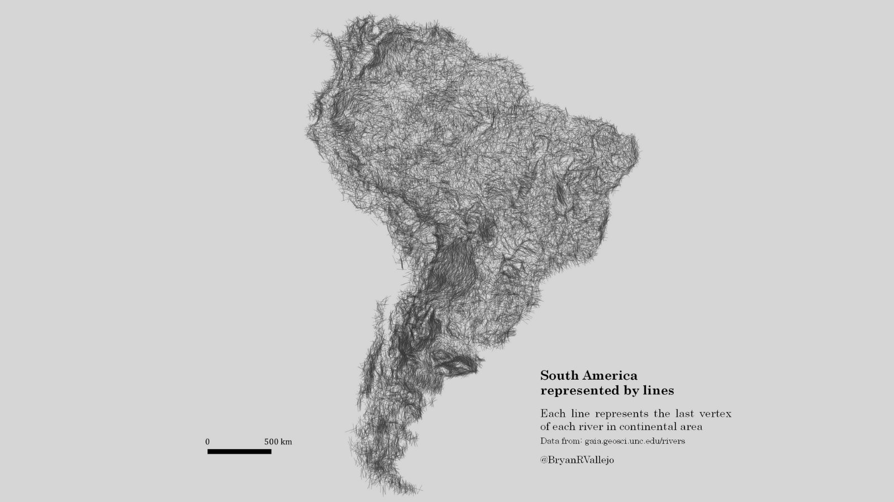

### Day 3: Polygons
```
Candy map style. The #population of municipalities in #Finland represented by smoothed squared #polygons #QGIS and geometry generator
```
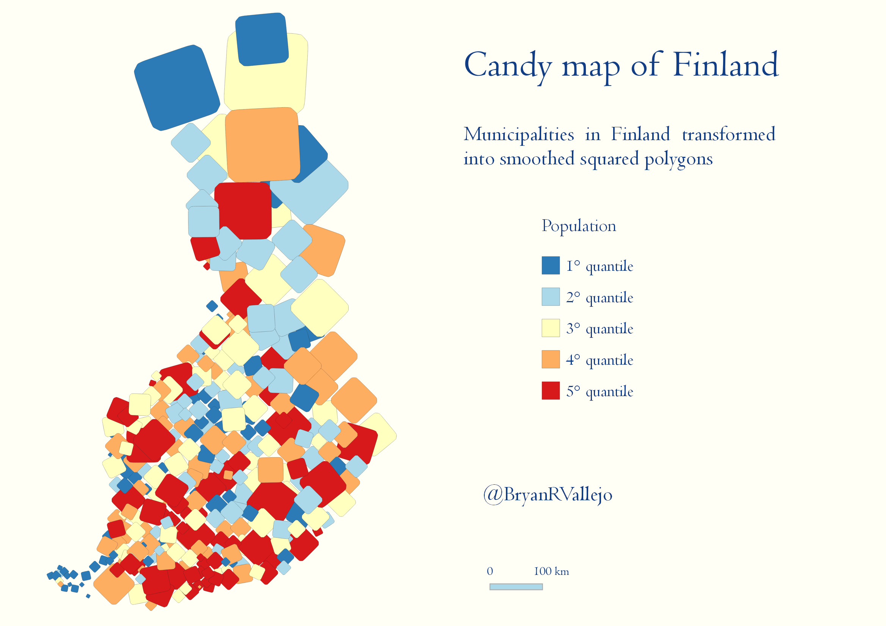

### Day 4: Hexagons
```
Still standing Smallest subdivision of global #regions as Hexagon. Data from https://gadm.org my new favorite #QGIS
```
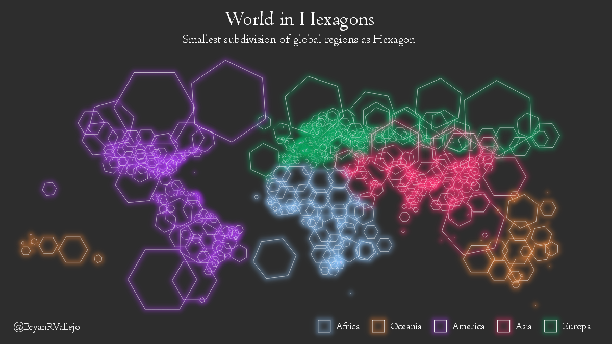

### Day 5: OSM
```
It's hip to be square? Squareness of buildings in Helsinki. OSM data loaded swiftly with #pyrosm by @tenkahen and squareness calculated with #momepy by @martinfleis. Visualization in @QGIS
```
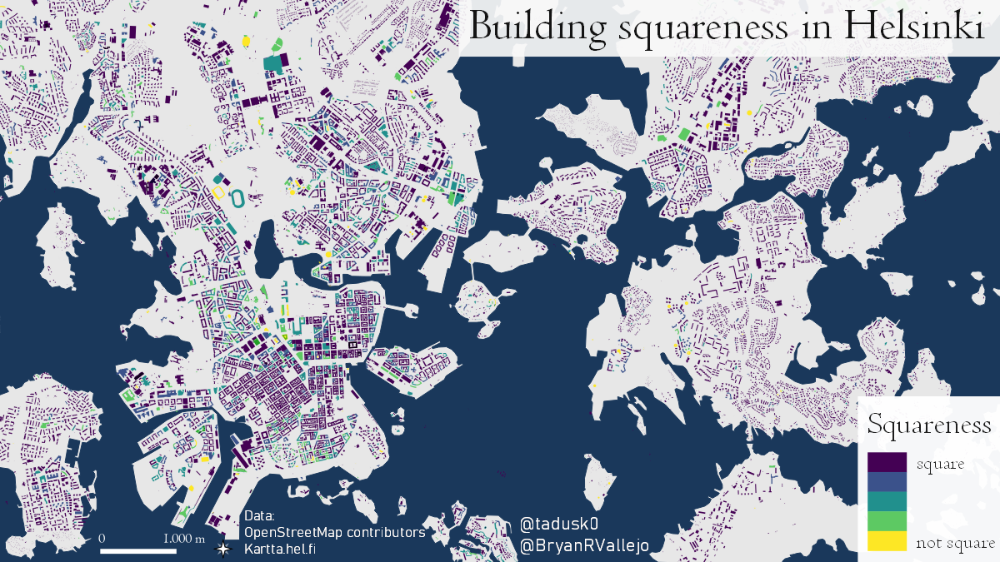

### Day 8: Blue
```
Ecuador is shaped by its rivers’. The mountainous, tropical country has an extraordinarily dense hydrological network. Data from http://gaia.geosci.unc.edu/rivers @GeoHelsinkiUni @KumpulaScience @HelsinkiUni
```
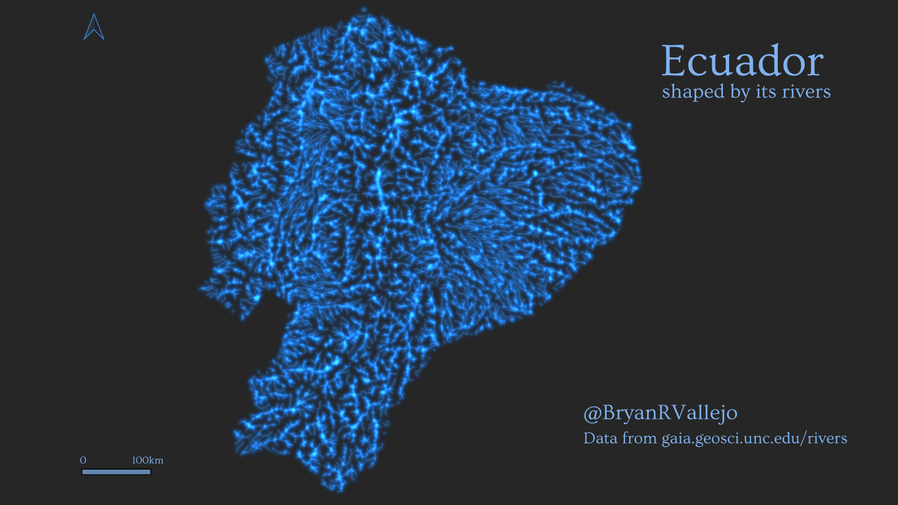

### Day 9: Monochrome
```
Direct flights from the capital city of #Ecuador and #Estonia. I just recalled a dataset I did while I was in @unitartu #Tartu with this historical database of flights (2014) from https://openflights.org/data.html
```
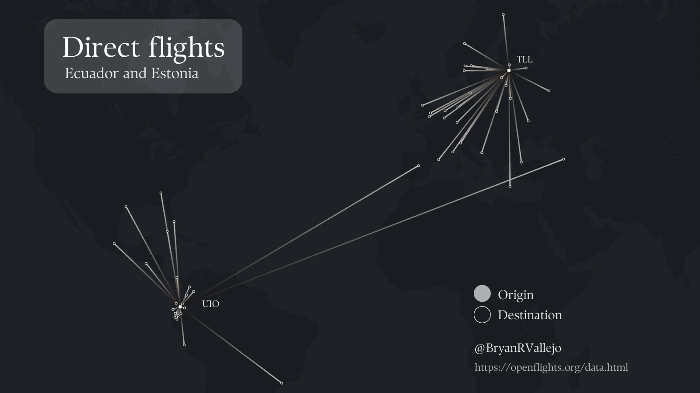

### Day 10: Raster
```
#Geography is fascinating! "Chlorophyll concentration during El Niño Warm Ocean Current in the Galápagos Islands". I learnt this at @unitartu #geoinformatics C2RCC water processing #Sentinel3 OLCI March #Galapagos #Ecuador #Copernicus
```
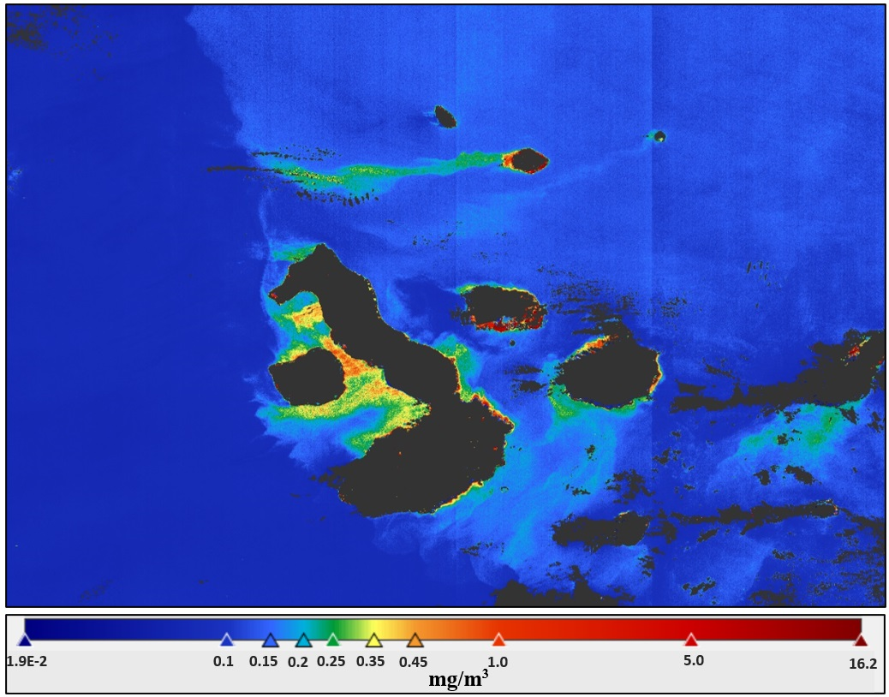

### Day 11: 3D
```
Helsinki metro-region bike-sharing movements, aggregated between bike stations. Seems it was a busy July (2019) in #Helsinki city centre. Data: @HSLdevcom Online demo: https://bit.ly/31UE3fD @GeoHelsinkiUni @helsinkiuni
```
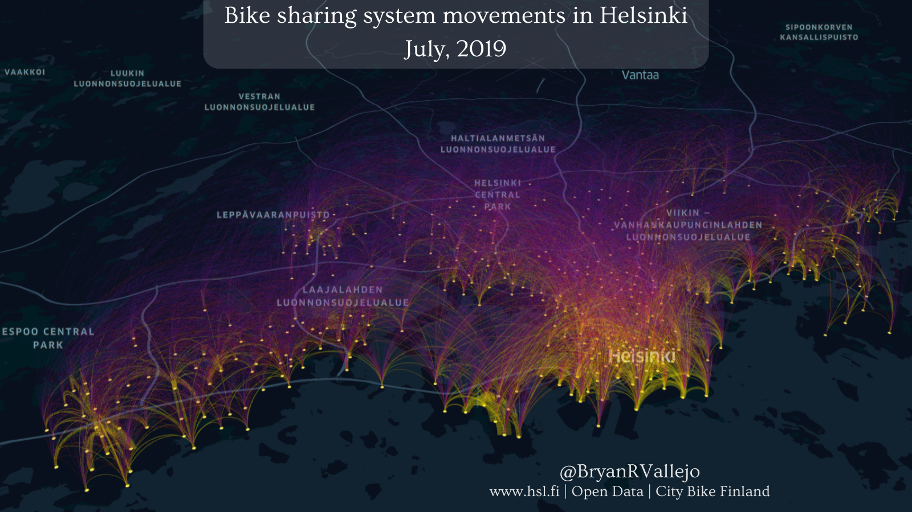

### Day 12: Population
```
Distribution of foreign people visiting #Finland from Twitter data. Using our #opentools to study cross-border mobility http://bit.ly/3FaUpPx. With @ollejarv w/ #keplergl #GeoHelsinkiUni @KumpulaScience @HelsinkiUni Digital Geography Lab
```
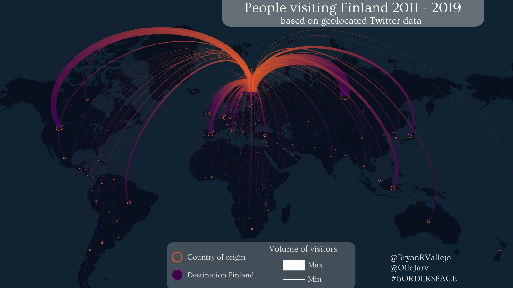

### Day 14: Map with a new tool
```
Cartogram of Nordic mobility derived from Twitter data on NUTS2-level. With @OlleJarv & @haavardaagesen w/ #Cartogram3 in #QGIS @GeoHelsinkiUni @KumpulaScience @helsinkiuni
```
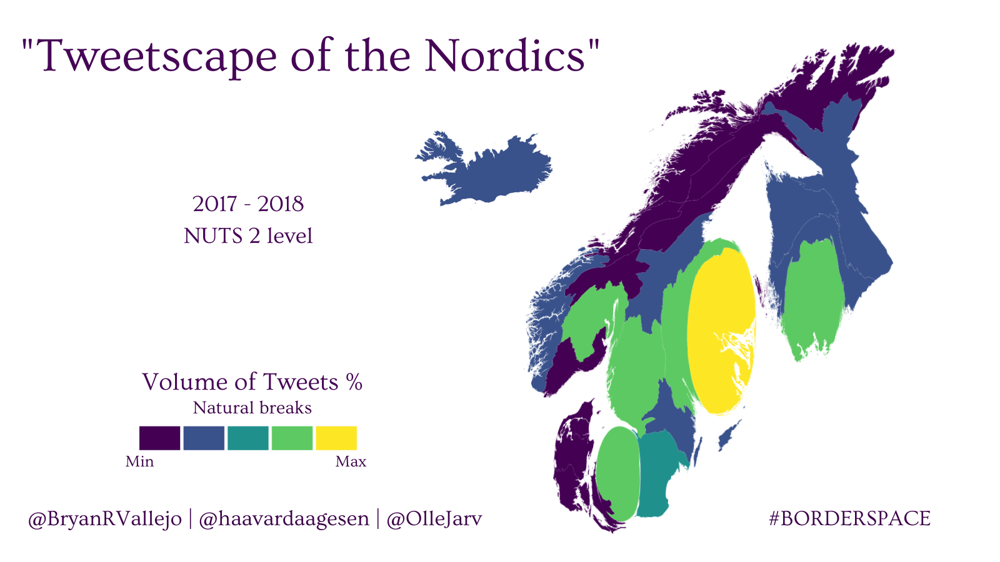

### Day 15: Map without using a computer
```
Where do Digital Geography Lab members come from? Origins as balloons on hand-drawn world map! Thanks @apaarlah for piloting the drone! Making this was fun! @GeoHelsinkiUni @KumpulaScience @HelsinkiUni Digital Geography Lab
```
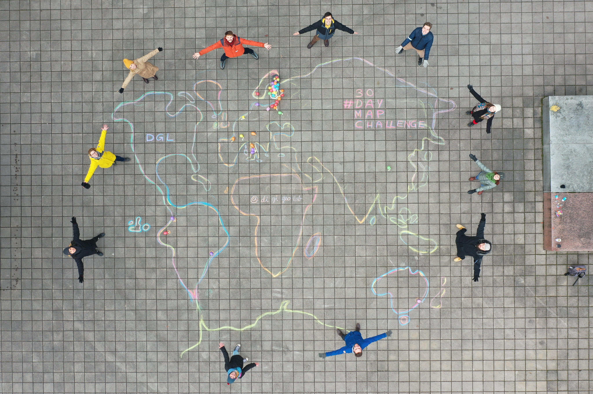

### Day 16: Urban/Rural
```
Urban areas by census units #EC Urban sectors classified by source (i.e. orthoimage, google maps, etc), all the rest is rurality. Demo: https://bit.ly/3HsRbZG @unfoldedinc #30DayMapChallenge #INEC
```
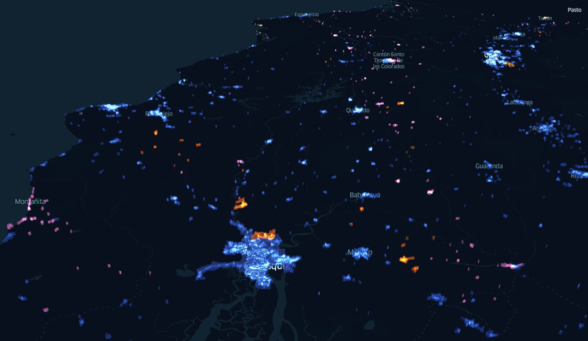

### Day 20: Movement
```
The main stops in bird’s migration: “4 months in the life of a Barnacle Goose”, stops detected in trajectory. Made with @gis4_wildlife and #movingpandas @underdarkGIS #MovementAnalysis #wildlife #MovementEcology
```
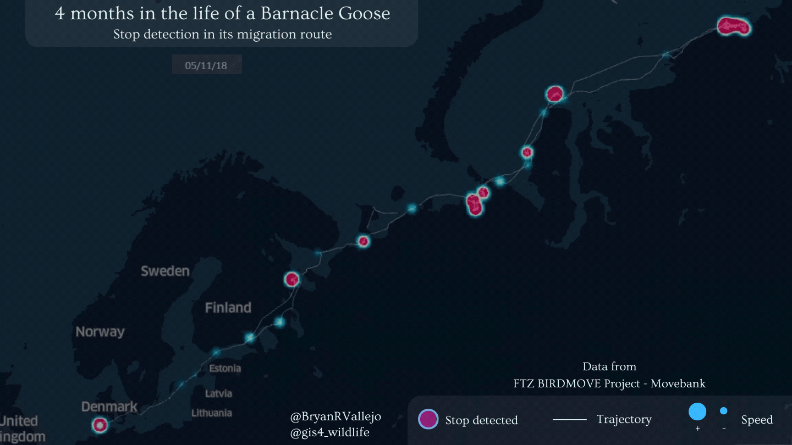

### Day 24: Historical map
```
Building development in Helsinki since the 20’s. #ISSonVis 2.21
```
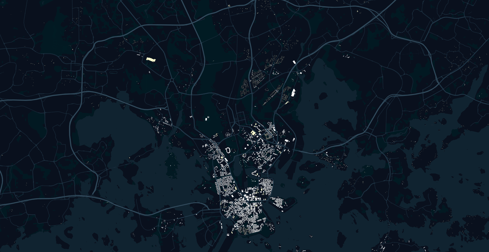

### Day 25: Interactive
```
Urban agglomerations viewer. It is just nice to be hanging around checking the names and population of the world cities. Demo here: https://bryanvallejo16.github.io/urban-viewer-worldwide/ and tutorial in Towards Data Science here": https://bit.ly/3xmcqaN @TDataScience #leaflet #UnitedNations 
```


### Day 27: Heatmap
```
’Wildfires in #Madagascar for 2020’ is a ‘heat visualization’ showing wildfire concentration with a 1-month interval, highlighting West-East spread. @eklund_jo in @unfoldedinc. Demo: https://bit.ly/3p0yCmX
```
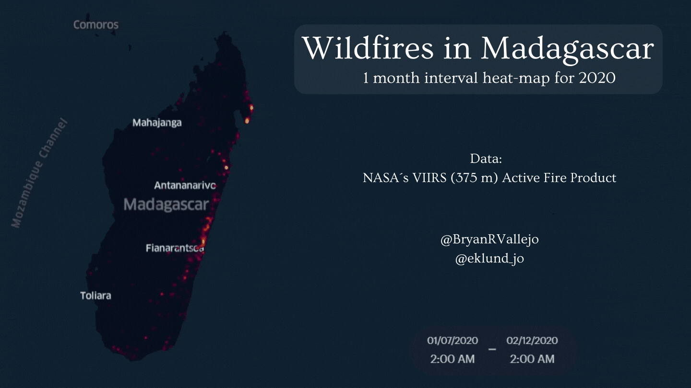

### Day 28: Earth is not flat
```
The Arctic tern knos about rounding the planet. This globe map shows its migration pole-to-pole. @OBISNetwork
```
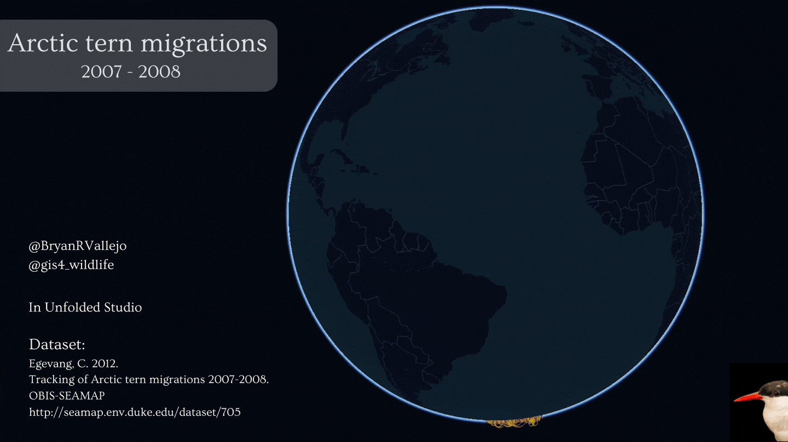
