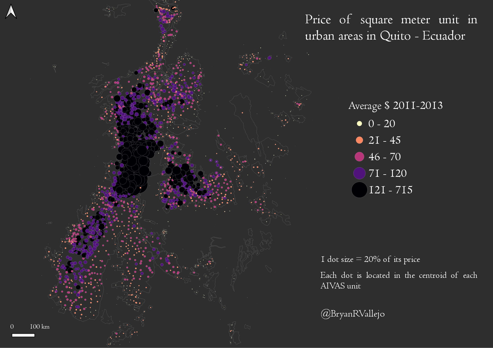

### My 30DayMapChallenge 2021 

The initiative of #30DayMapChallenge was created by Topi Tjukanov and it happened on twitter during November. Get to know the official website [30daymapchallenge.com](https://30daymapchallenge.com/) and all the inspiring creations of the geospatial community all over the world.

It was difficult to handle all 30 maps but not impossible to do some. I discovered a lot of talented cartographers in November 2021 who inspired me with new ideas. I am glad I was part of this wonderful initiative and I discovered that every day is a good day to do some cartography. Some of the maps were done with friends/colleagues members of @digigeolab | Digital Geography Lab - University of Helsinki

My personal profile [Bryan R. Vallejo](https://www.linkedin.com/in/bryanrvallejo/)

### Day 1: Points



```

```
